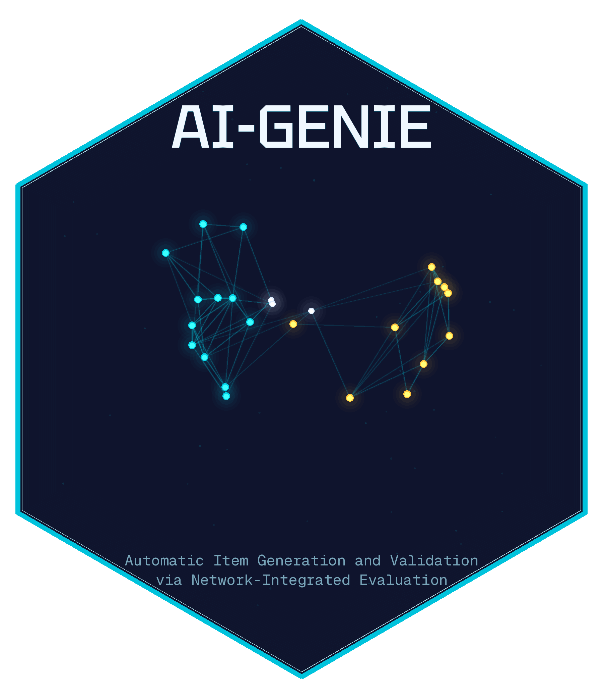

<div id="badges">

<a href="https://github.com/laralee/AIGENIE/releases"></a>
<a href="https://www.repostatus.org/#active"></a>
<a href="https://github.com/laralee/AIGENIE"></a>

</div>

# AI-GENIE: Automatic Item Generation and Validation via Network-Integrated Evaluation

**AI-GENIE** is an R package for automated psychological scale development and structural validation using **large language models (LLMs)** and **network psychometric methods**.

The AI-GENIE framework integrates:

- LLM-based **item generation**
- **Embedding representations** of candidate items
- **Exploratory Graph Analysis (EGA)** for dimensional structure estimation
- **Unique Variable Analysis (UVA)** to detect redundant items
- **Bootstrap EGA (bootEGA)** to evaluate dimensional and item stability

This workflow allows researchers to develop and refine psychological scales **prior to collecting empirical data**, dramatically accelerating measurement development.

AI-GENIE supports:

- Fully automated **item generation pipelines**
- Validation of **user-provided item sets**

```
Item attributes → LLM generation → Embeddings → EGA → UVA → bootEGA → Final scale
```

---

# System Setup

AI-GENIE relies on a **Python environment** (managed through `reticulate`) for interacting with LLM APIs and embedding models.

The package uses **`uv`**, a fast Python environment manager.

---

# Windows Setup

### Install `uv`

Open **Windows PowerShell** and run:

```bash
curl -LsSf https://astral.sh/uv/install.ps1 | powershell
```

If successful, the installation will end with a message indicating everything was installed successfully.

Then:

1. Restart R
2. Restart your computer
3. Re-open your R script

---

# macOS Setup

### Install Command Line Tools

Open Terminal and run:

```bash
xcode-select --install
```

### Install `uv`

```bash
curl -LsSf https://astral.sh/uv/install.sh | sh
```

If you encounter a **permission denied** error, run:

```bash
echo 'export PATH="$HOME/.local/bin:$PATH"' >> ~/.zshrc
source ~/.zshrc
```

Then rerun the install command.

Restart **R / RStudio** afterwards.

---

# Installing Dependencies

Install required R packages:

```r
install.packages("reticulate")
install.packages("ggplot2")
install.packages("igraph")
install.packages("patchwork")
install.packages("jsonlite")
install.packages("EGAnet")
install.packages("remotes")
```

---

# Installing AIGENIE

Install the development version from GitHub:

```r
remotes::install_github("laralee/AIGENIE")
```

---

# Initialize the Python Environment

On first use, run:

```r
library(AIGENIE)

ensure_aigenie_python()
```

Helpful utilities:

```r
python_env_info()

reinstall_python_env()
```

---

# API Keys

AI-GENIE supports multiple LLM providers.

You only need **one provider**, but several can be combined.

| Provider | Purpose | Get a Key |
|---|---|---|
| **OpenAI** | Item generation + embeddings | [platform.openai.com](https://platform.openai.com/) |
| **Groq** | Fast item generation (open-source models) | [console.groq.com](https://console.groq.com/) |
| **Anthropic** | Item generation (Claude models) | [console.anthropic.com](https://console.anthropic.com/) |
| **Jina AI** | Embeddings | [jina.ai](https://jina.ai/) |
| **Hugging Face** | Local/API embeddings | [huggingface.co](https://huggingface.co/) |

---

# Quick Example

```r
library(AIGENIE)
library(EGAnet)

# Define what you want to measure
item_attributes <- list(
  neuroticism = c("anxious", "depressed", "insecure", "emotional"),
  extraversion = c("outgoing", "energetic", "assertive", "sociable")
)

# Define item type descriptions
item_definitions <- list(
  neuroticism = "Neuroticism: tendency toward negative emotions",
  extraversion = "Extraversion: tendency toward positive social engagement"
)

# Run the full pipeline
results <- AIGENIE(
  item.attributes = item_attributes,
  openai.API = "your-openai-key",
  domain = "personality psychology",
  scale.title = "Big Five Personality Inventory",
  item.type.definitions = item_definitions,
  target.N = 60
)

# Examine results
results$item_type_level$neuroticism$stability_plot
results$overall$network_plot
```

---

# Using Different Providers

### Groq + OpenAI

```r
results <- AIGENIE(
  item.attributes = item_attributes,
  groq.API = "your-groq-key",
  openai.API = "your-openai-key",
  model = "llama-3.3-70b-versatile",
  embedding.model = "text-embedding-3-small",
  target.N = 60
)
```

### Anthropic + Jina

```r
results <- AIGENIE(
  item.attributes = item_attributes,
  anthropic.API = "your-anthropic-key",
  jina.API = "your-jina-key",
  model = "sonnet",
  embedding.model = "jina-embeddings-v3",
  target.N = 60
)
```

---

# Main Functions

| Function | Description |
|---|---|
| `AIGENIE()` | Full pipeline: generate items → embeddings → EGA → UVA → bootEGA |
| `GENIE()` | Validation pipeline for user-provided items |
| `chat()` | Send prompts to supported LLMs |
| `list_available_models()` | List models across providers |
| `local_AIGENIE()` | Run pipeline with locally hosted LLMs |
| `local_GENIE()` | Validate items with local models |
| `local_chat()` | Chat with local models |
| `ensure_aigenie_python()` | Configure Python environment |
| `python_env_info()` | Show environment details |
| `reinstall_python_env()` | Rebuild Python environment |
| `set_huggingface_token()` | Configure Hugging Face access |
| `install_local_llm_support()` | Install local LLM dependencies |
| `install_gpu_support()` | Enable GPU acceleration |
| `check_local_llm_setup()` | Verify local LLM configuration |
| `get_local_llm()` | Download local LLM models |

---

# Supported Models

Model availability changes as providers update their catalogs. You can query the current list of available models directly:

```r
# Per-provider queries
list_available_models("openai",    openai.API = openai_key)
list_available_models("groq",      groq.API = groq_key)
list_available_models("anthropic", anthropic.API = anthropic_key)
list_available_models("jina")

# All providers at once
list_available_models(
  openai.API    = openai_key,
  groq.API      = groq_key,
  anthropic.API = anthropic_key
)

# Filter by type
list_available_models(openai.API = openai_key, type = "chat")
list_available_models(openai.API = openai_key, type = "embedding")
```

Below is a reference snapshot of commonly used models and their aliases.

### Chat Models

| Provider | Models | Aliases |
|---|---|---|
| **OpenAI** | `gpt-4o`, `gpt-4o-mini`, `gpt-4-turbo`, `gpt-4`, `gpt-3.5-turbo`, `o1`, `o1-mini` | `gpt4o`, `chatgpt` |
| **Anthropic** | `claude-sonnet-4-5-20250929`, `claude-opus-4-20250514`, `claude-haiku-4-5-20251001` | `sonnet`, `opus`, `haiku`, `claude` |
| **Groq** | `llama-3.3-70b-versatile`, `llama-3.1-8b-instant`, `mixtral-8x7b-32768`, `gemma2-9b-it`, `deepseek-r1-distill-llama-70b`, `qwen-2.5-72b` | `llama3`, `mixtral`, `gemma`, `deepseek`, `qwen` |
| **Groq (slash-style)** | `meta-llama/llama-4-scout-17b-16e-instruct`, `qwen/qwen3-32b`, and others | Pass with `groq.API` |

### Embedding Models

| Provider | Models |
|---|---|
| **OpenAI** | `text-embedding-3-small`, `text-embedding-3-large`, `text-embedding-ada-002` |
| **Jina AI** | `jina-embeddings-v4`, `jina-embeddings-v3`, `jina-embeddings-v2-base-en`, `jina-clip-v2` |
| **Hugging Face** | `BAAI/bge-small-en-v1.5`, `BAAI/bge-base-en-v1.5`, `thenlper/gte-small` |
| **Local** | `sentence-transformers/all-MiniLM-L6-v2`, `bert-base-uncased`, and others |

---

# Authors

### Lara Russell-Lasalandra
PhD Student, Quantitative Methods, Department of Psychology, University of Virginia
<br>Contact: [llr7cb@virginia.edu](mailto:llr7cb@virginia.edu)

### Alexander P. Christensen
Assistant Professor of Quantitative Methods, Department of Psychology and Human Development, Vanderbilt University
<br>Contact: [alexander.christensen@vanderbilt.edu](mailto:alexander.christensen@vanderbilt.edu)

### Hudson F. Golino
Associate Professor of Quantitative Methods, Department of Psychology, University of Virginia
<br>Contact: [hfg9s@virginia.edu](mailto:hfg9s@virginia.edu)

---

# References

Russell-Lasalandra, L. L., Christensen, A. P., & Golino, H. (2025, August 29). Generative Psychometrics via AI-GENIE: Automatic Item Generation with Network-Integrated Evaluation. [https://doi.org/10.31234/osf.io/fgbj4_v2](https://doi.org/10.31234/osf.io/fgbj4_v2)
+ Related functions: `AIGENIE`, `GENIE`

Garrido, L., Russell-Lasalandra, L. L., & Golino, H. (2025, December 30). Estimating Dimensional Structure in Generative Psychometrics: Comparing PCA and Network Methods Using Large Language Model Item Embeddings. [https://doi.org/10.31234/osf.io/2s7pw_v1](https://doi.org/10.31234/osf.io/2s7pw_v1)
+ Related functions: `AIGENIE`, `GENIE`

Golino, H., Garrido, L., & Russell-Lasalandra, L. L. (2026). Optimizing the Landscape of LLM Embeddings with Dynamic Exploratory Graph Analysis for Generative Psychometrics: A Monte Carlo Study. *arXiv*. arXiv:2601.17010. [https://doi.org/10.48550/arXiv.2601.17010](https://doi.org/10.48550/arXiv.2601.17010)
+ Related functions: `AIGENIE`, `GENIE`

Christensen, A. P., Garrido, L. E., & Golino, H. (2023). Unique variable analysis: A network psychometrics method to detect local dependence. *Multivariate Behavioral Research*. doi:[10.1080/00273171.2023.2194606](https://doi.org/10.1080/00273171.2023.2194606)
+ Related functions: UVA step in `AIGENIE` and `GENIE`

Christensen, A. P., & Golino, H. (2021). Estimating the stability of psychological dimensions via Bootstrap Exploratory Graph Analysis: A Monte Carlo simulation and tutorial. *Psych*, *3*(3), 479-500. doi:[10.3390/psych3030032](https://doi.org/10.3390/psych3030032)
+ Related functions: bootEGA step in `AIGENIE` and `GENIE`

Golino, H., & Epskamp, S. (2017). Exploratory graph analysis: A new approach for estimating the number of dimensions in psychological research. *PLoS ONE*, *12*, e0174035. doi:[10.1371/journal.pone.0174035](https://doi.org/10.1371/journal.pone.0174035)
+ Related functions: EGA step in `AIGENIE` and `GENIE`

Golino, H., Shi, D., Christensen, A. P., Garrido, L. E., Nieto, M. D., Sadana, R., Thiyagarajan, J. A., & Martinez-Molina, A. (2020). Investigating the performance of exploratory graph analysis and traditional techniques to identify the number of latent factors: A simulation and tutorial. *Psychological Methods*, *25*, 292-320. doi:[10.1037/met0000255](https://doi.org/10.1037/met0000255)
+ Related functions: EGA step in `AIGENIE` and `GENIE`

---

# License

AGPL (>= 3.0)
